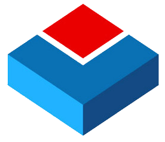

<h1 align="center">TSPilot: Agentic AI-native Time Series Data Interaction System</h1>

<p align="center"><b>Connect, query, analyze, and understand time-series data through natural language</b></p>

<p align="center">
  
  
  
  
  
  
  <a href="LICENSE"></a>
</p>

<p align="center">
  Natural-language data interaction&nbsp;&nbsp;·&nbsp;&nbsp;Multiple time-series databases&nbsp;&nbsp;·&nbsp;&nbsp;Full-result analysis<br>
  Reusable analytical artifacts&nbsp;&nbsp;·&nbsp;&nbsp;Visual verification of analytical conclusions
</p>

<p align="center">
  <b>English</b>&nbsp;&nbsp;|&nbsp;&nbsp;<a href="README_cn.md">简体中文</a>
</p>

<p align="center">
  <a href="#-updates">Updates</a>&nbsp;&nbsp;•&nbsp;&nbsp;
  <a href="#-product-demo">Product demo</a>&nbsp;&nbsp;•&nbsp;&nbsp;
  <a href="#-core-capabilities">Core capabilities</a>&nbsp;&nbsp;•&nbsp;&nbsp;
  <a href="#-quick-start">Quick start</a>&nbsp;&nbsp;•&nbsp;&nbsp;
  <a href="#-database-connectivity">Database connectivity</a>&nbsp;&nbsp;•&nbsp;&nbsp;
  <a href="#-project-documentation">Documentation</a>
</p>

---

## 📣 Updates

- **August 21, 2026:** TSPilot v0.1 officially released 🎉🎉.

## 🧭 Why TSPilot

Time-series analysis involves much more than writing a database query. Users often need to understand **data structure, time ranges, aggregation choices, and data quality**, then move repeatedly between querying, analysis, and visualization tools before reaching a reliable conclusion.

TSPilot connects **natural-language interaction** with **time-series querying, analysis, and visualization**. It helps users explore data, detect anomalies, forecast future values, discover patterns, and produce **conclusions grounded in real evidence**.

The artifacts and insights created during one analysis can be **reused in later questions**, allowing an investigation to continue naturally instead of starting from scratch.

## 🎬 Product demo

<p align="center">
  <video src="video-en.mov" controls width="1200" title="Product demo"></video><br>
  <sub>Connect time-series data, ask questions, and continue an analysis in one workspace</sub><br>
  <a href="video-en.mov">▶ Watch the demo</a>
</p>

<!-- <p align="center">
  <code>Connect</code>&nbsp;&nbsp;→&nbsp;&nbsp;<code>Ask</code>&nbsp;&nbsp;→&nbsp;&nbsp;<code>Analyze</code>&nbsp;&nbsp;→&nbsp;&nbsp;<code>Verify</code>
</p> -->

## ✨ Core capabilities

<table>
  <thead>
    <tr>
      <th width="32%">Capability</th>
      <th>Description</th>
    </tr>
  </thead>
  <tbody>
    <tr><td>💬 <b>Natural-language data interaction</b></td><td>Query, explore, and analyze time-series data using ordinary language.</td></tr>
    <tr><td>🗄️ <b>Multiple time-series databases</b></td><td>Connect and manage different time-series databases through one consistent experience.</td></tr>
    <tr><td>📊 <b>Full-result analysis</b></td><td>Perform statistical analysis, forecasting, anomaly detection, and pattern discovery over complete query results.</td></tr>
    <tr><td>♻️ <b>Reusable analytical artifacts</b></td><td>Preserve query results, insights, and visualizations for follow-up questions and continued analysis.</td></tr>
    <tr><td>📈 <b>Visual verification</b></td><td>Combine complete time series, forecast intervals, anomaly points, and key windows in interactive line charts.</td></tr>
  </tbody>
</table>

## 🚀 Quick start

### 1. Prerequisites

- Python 3.10+
- Node.js and npm
- An OpenAI-compatible model endpoint
- An accessible time-series database

### 2. Install

```bash
git clone https://github.com/feilvvl/TSPilot.git
cd TSPilot

python3 -m venv .venv
source .venv/bin/activate
pip install -r requirements.txt
npm --prefix frontend install
```

On Windows, activate the virtual environment with `.venv\Scripts\activate`.

### 3. Start TSPilot

Open two terminals in the project root and start the backend and frontend separately.

Terminal 1 (backend):

```bash
source .venv/bin/activate
python -m uvicorn app.server:app --host 127.0.0.1 --port 5680
```

Terminal 2 (frontend):

```bash
cd frontend
npm run dev
```

Open:

- Web interface: `http://localhost:5173`
- Backend API: `http://127.0.0.1:5680`
- API documentation: `http://127.0.0.1:5680/docs`

### 4. Complete the initial setup

After startup:

1. Open **Model Management**, add an OpenAI-compatible language model, and provide its API key.
2. Configure an embedding, forecast model, or anomaly detector when needed.
3. Open **Database Management**, add a database, and test the connection.

Model and database settings are stored in the local workspace. No `.env` file is required.

### 5. Ask a question

Select a connected database and ask a question in natural language. TSPilot will organize the required query, calculation, anomaly detection, forecasting, and visualization steps, then preserve the supporting evidence in its final answer.

## 🗄️ Database connectivity

TSPilot provides unified access to 24 time-series database connection types. Databases can be added and tested in the Web interface or maintained as YAML files under `configs/databases/`. Once configured, users can query and analyze data from different sources through a consistent natural-language experience.

<h3 align="center">🔌 Supported databases</h3>

<p align="center"><sub>Configure once, then connect, query, and analyze different data sources in a consistent way.</sub></p>

<table align="center">
  <tr>
    <td align="center"><br><sub><b>InfluxDB 2 / 3</b></sub></td>
    <td align="center"><br><sub><b>kdb+</b></sub></td>
    <td align="center"><br><sub><b>Prometheus</b></sub></td>
    <td align="center"><br><sub><b>TimescaleDB</b></sub></td>
    <td align="center"><br><sub><b>DolphinDB</b></sub></td>
    <td align="center"><br><sub><b>Apache Druid</b></sub></td>
  </tr>
  <tr>
    <td align="center"><br><sub><b>QuestDB</b></sub></td>
    <td align="center"><br><sub><b>TDengine</b></sub></td>
    <td align="center"><br><sub><b>Apache IoTDB</b></sub></td>
    <td align="center"><br><sub><b>VictoriaMetrics</b></sub></td>
    <td align="center"><br><sub><b>GridDB</b></sub></td>
    <td align="center"><br><sub><b>Arc</b></sub></td>
  </tr>
  <tr>
    <td align="center"><br><sub><b>M3DB</b></sub></td>
    <td align="center"><br><sub><b>CrateDB</b></sub></td>
    <td align="center"><br><sub><b>CnosDB</b></sub></td>
    <td align="center"><br><sub><b>ArcadeDB</b></sub></td>
    <td align="center"><br><sub><b>GreptimeDB</b></sub></td>
    <td align="center"><br><sub><b>IBM Db2</b></sub></td>
  </tr>
  <tr>
    <td align="center"><br><sub><b>Riak TS</b></sub></td>
    <td align="center"><br><sub><b>BangDB</b></sub></td>
    <td align="center"><br><sub><b>Machbase Neo</b></sub></td>
    <td align="center"><br><sub><b>OpenMLDB</b></sub></td>
    <td align="center"><br><sub><b>openGemini</b></sub></td>
    <td align="center"><b>＋</b><br><sub><b>More databases</b></sub><br><sub>Coming soon</sub></td>
  </tr>
</table>

Connection methods and runtime dependencies vary across databases. Refer to the corresponding database documentation for details.

For setup details, see the [database configuration guide](docs/guides/database-configuration.md).

## 📚 Project documentation

| | Goal | Document |
|:---:|---|---|
| 🧭 | Understand system design and capability boundaries | [System architecture](docs/architecture/system.md) |
| 🔗 | Integrate with the chat API | [Chat API contract](docs/contracts/api.md) |
| 📈 | Understand how data and Insights become interactive charts | [Visualization guide](docs/contracts/visualization-v5.md) |
| 🗄️ | Connect a time-series database | [Database configuration guide](docs/guides/database-configuration.md) |

See the [documentation index](docs/README.md) for the complete public documentation set.

## 🤝 Contributing

Issues and pull requests are welcome.

Changes to agent behavior, tool contracts, database connectors, or public APIs should keep a clear scope, include relevant tests, and update the corresponding specification documents.

## 📮 Contact

For questions or collaboration, contact [feilv@hnu.edu.cn](mailto:feilv@hnu.edu.cn).
