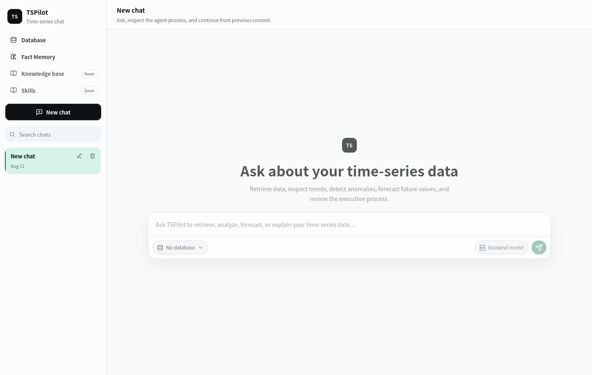

<h1 align="center">TSPilot：面向时序数据交互的 AI 原生智能体系统</h1>

<p align="center"><b>用自然语言连接、查询、分析并理解时序数据</b></p>

<p align="center">
  
  
  
  
  
  
  <a href="LICENSE"></a>
</p>

<p align="center">
  自然语言数据交互&nbsp;&nbsp;·&nbsp;&nbsp;多时序数据库接入&nbsp;&nbsp;·&nbsp;&nbsp;完整查询结果分析<br>
  可复用的分析产物&nbsp;&nbsp;·&nbsp;&nbsp;分析结论可视化验证
</p>

<p align="center">
  <a href="README.md">英文</a>&nbsp;&nbsp;|&nbsp;&nbsp;<b>简体中文</b>
</p>

<p align="center">
  <a href="#-最新动态">最新动态</a>&nbsp;&nbsp;•&nbsp;&nbsp;
  <a href="#-产品界面">产品界面</a>&nbsp;&nbsp;•&nbsp;&nbsp;
  <a href="#-核心能力">核心能力</a>&nbsp;&nbsp;•&nbsp;&nbsp;
  <a href="#-快速开始">快速开始</a>&nbsp;&nbsp;•&nbsp;&nbsp;
  <a href="#-数据库接入">数据库接入</a>&nbsp;&nbsp;•&nbsp;&nbsp;
  <a href="#-项目文档">项目文档</a>
</p>

---

## 📣 最新动态

- **【2026-08-21】** TSPilot v0.1 正式发布 🎉🎉。

## 🧭 为什么需要 TSPilot

时序数据分析不只是编写一条数据库查询。用户通常还需要理解**数据结构、时间范围、聚合方式和数据质量**，并在不同的查询、分析和可视化工具之间反复切换，才能得到可靠的结论。

TSPilot 将**自然语言交互**与**时序数据查询、分析和可视化**连接起来，帮助用户完成数据探索、预测、异常检测和模式发现，并生成**有数据依据的分析结论**。

分析过程中产生的分析结论可以**在后续问题中继续复用**，让一次分析自然延伸为连续、深入的数据探索。

## 🖥️ 产品界面

<table align="center">
  <tr>
    <td align="center">
      <a href="tspilot-page.png"></a><br>
      <sub>通过统一界面连接时序数据，发起查询并完成连续的数据分析 · 点击查看大图</sub>
    </td>
  </tr>
</table>

<!-- <p align="center">
  <code>连接</code>&nbsp;&nbsp;→&nbsp;&nbsp;<code>提问</code>&nbsp;&nbsp;→&nbsp;&nbsp;<code>分析</code>&nbsp;&nbsp;→&nbsp;&nbsp;<code>验证</code>
</p> -->

## ✨ 核心能力

<table>
  <thead>
    <tr>
      <th width="32%">特性</th>
      <th>详细说明</th>
    </tr>
  </thead>
  <tbody>
    <tr><td>💬 <b>自然语言数据交互</b></td><td>通过自然语言完成时序数据的查询、探索和分析，降低数据库查询与数据分析的使用门槛。</td></tr>
    <tr><td>🗄️ <b>多种时序数据库接入</b></td><td>统一连接和管理不同类型的时序数据库，为用户提供一致的数据交互体验。</td></tr>
    <tr><td>📊 <b>完整查询结果分析</b></td><td>面向查询返回的完整数据开展统计分析、预测、异常检测和模式发现，获得更全面、可靠的分析结果。</td></tr>
    <tr><td>♻️ <b>可复用的分析产物</b></td><td>将查询结果、分析结论和可视化内容沉淀为可复用的分析产物，支持在后续问题和连续分析中继续引用。</td></tr>
    <tr><td>📈 <b>分析结论可视化验证</b></td><td>将完整时序、预测区间、异常点和关键时间窗口组合为可交互折线图，帮助用户直观理解并验证分析结论。</td></tr>
  </tbody>
</table>

## 🚀 快速开始

### 1. 环境准备

- Python 3.10+
- Node.js 和 npm
- OpenAI 兼容模型服务
- 可访问的时序数据库

### 2. 安装项目

```bash
git clone https://github.com/feilvvl/TSPilot.git
cd TSPilot

python3 -m venv .venv
source .venv/bin/activate
pip install -r requirements.txt
npm --prefix frontend install
```

Windows 用户请使用 `.venv\Scripts\activate` 激活虚拟环境。

### 3. 启动服务

在项目根目录打开两个终端，分别启动后端和前端。

终端一（后端）：

```bash
source .venv/bin/activate
python -m uvicorn app.server:app --host 127.0.0.1 --port 5680
```

终端二（前端）：

```bash
cd frontend
npm run dev
```

默认访问地址：

- 网页界面：`http://localhost:5173`
- 后端 API：`http://127.0.0.1:5680`
- API 文档：`http://127.0.0.1:5680/docs`

### 4. 完成初始配置

启动后，在网页界面中完成以下设置：

1. 打开 **模型管理**，添加 OpenAI 兼容语言模型并填写 API 密钥；
2. 根据需要配置嵌入模型、预测模型和异常检测模型；
3. 打开 **数据库管理**，添加数据库连接并测试连接状态。

模型与数据库配置会保存在本地工作区，无需创建 `.env` 文件。

### 5. 开始提问

选择一个已连接的数据库，然后直接使用自然语言提问，TSPilot 会根据问题自动组织查询、计算、异常检测、预测和可视化步骤，并在最终回答中保留数据依据。

## 🗄️ 数据库接入

TSPilot 支持统一接入和管理多种时序数据库。数据库可以直接在网页界面中添加和测试，也可以通过 `configs/databases/` 中的 YAML 文件维护。完成配置后，用户可以通过一致的自然语言交互方式查询和分析不同来源的时序数据。

<h3 align="center">🔌 目前支持的数据库</h3>

<p align="center"><sub>一次配置，以一致的方式连接、查询和分析不同来源的时序数据。</sub></p>

<table align="center">
  <tr>
    <td align="center"><br><sub><b>InfluxDB 2 / 3</b></sub></td>
    <td align="center"><br><sub><b>kdb+</b></sub></td>
    <td align="center"><br><sub><b>Prometheus</b></sub></td>
    <td align="center"><br><sub><b>TimescaleDB</b></sub></td>
    <td align="center"><br><sub><b>DolphinDB</b></sub></td>
    <td align="center"><br><sub><b>Apache Druid</b></sub></td>
  </tr>
  <tr>
    <td align="center"><br><sub><b>QuestDB</b></sub></td>
    <td align="center"><br><sub><b>TDengine</b></sub></td>
    <td align="center"><br><sub><b>Apache IoTDB</b></sub></td>
    <td align="center"><br><sub><b>VictoriaMetrics</b></sub></td>
    <td align="center"><br><sub><b>GridDB</b></sub></td>
    <td align="center"><br><sub><b>Arc</b></sub></td>
  </tr>
  <tr>
    <td align="center"><br><sub><b>M3DB</b></sub></td>
    <td align="center"><br><sub><b>CrateDB</b></sub></td>
    <td align="center"><br><sub><b>CnosDB</b></sub></td>
    <td align="center"><br><sub><b>ArcadeDB</b></sub></td>
    <td align="center"><br><sub><b>GreptimeDB</b></sub></td>
    <td align="center"><br><sub><b>IBM Db2</b></sub></td>
  </tr>
  <tr>
    <td align="center"><br><sub><b>Riak TS</b></sub></td>
    <td align="center"><br><sub><b>BangDB</b></sub></td>
    <td align="center"><br><sub><b>Machbase Neo</b></sub></td>
    <td align="center"><br><sub><b>OpenMLDB</b></sub></td>
    <td align="center"><br><sub><b>openGemini</b></sub></td>
    <td align="center"><b>＋</b><br><sub><b>更多数据库</b></sub><br><sub>敬请期待</sub></td>
  </tr>
</table>

不同数据库的连接方式和运行依赖可能有所差异，具体配置请参考对应的数据库说明。

具体设置方式请参阅[数据库配置指南](docs/guides/database-configuration.md)。

## 📚 项目文档

| | 目标 | 文档 |
|:---:|---|---|
| 🧭 | 了解系统设计与能力边界 | [系统架构](docs/architecture/system.md) |
| 🔗 | 接入聊天 API | [聊天 API 契约](docs/contracts/api.md) |
| 📈 | 了解折线图数据结构 | [可视化契约](docs/contracts/visualization.md) |
| 🗄️ | 接入时序数据库 | [数据库配置指南](docs/guides/database-configuration.md) |

全部公共文档请参阅[文档索引](docs/README.md)。

## 🤝 参与贡献

欢迎提交问题反馈（Issue）和合并请求（Pull Request）。

涉及智能体行为、工具契约、数据库连接器或公共 API 的改动，应保持单一且明确的修改范围，补充相应测试，并同步更新相关规范文档。
